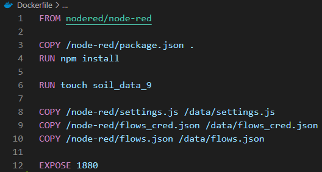
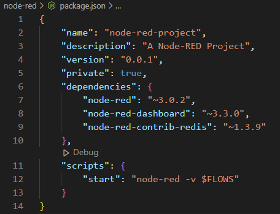
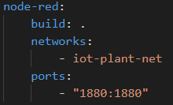
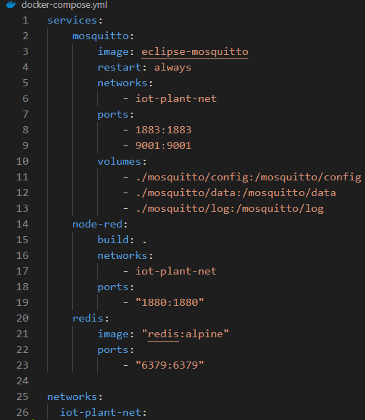
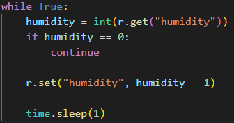
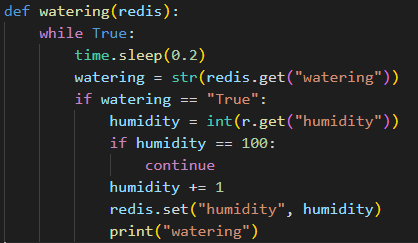

# PlantCare-IOT

PlantCare is a prototype of a smart plant irrigation system based on the Node-RED environment. The garden irrigation control is based on the weather forecast.

## System virtual devices

System contains two virtual devices:

- soil-sensor: checks the level of soil hydration and reacts to the low level case. Additionally, it has set a trigger for every morning and evening at fixed hours . Depending on the weather forecast for the day, irrigates the soil accordingly.
- sprinkler: thanks to mqtt broker, it listens for information about the need to water the soil and performs the task accordingly.

## Run application

All the components needed to run the system are stored in Docker containers. For easy running multi-container Docker applications, the **_docker-compose.yaml_** was created.

To run all necesary components:

```
docker compose up -d
```

To run Python files:

```
python sensor.py
python soil.py
python sprinkler.py
```

## Tools

### NodeRed

Default server is `http://127.0.0.1:1880/`

### System layout:


### Used node-red nodes:

* #### Mqtt nodes


***soil-sensor:***

A mqtt-in node with mqtt server. Listens on soil-sensor topic. With auto-detect (parsed JSON object, string or buffer) output. 

***sprinkler:***

A mqtt-out with mqtt server. A topic is sprinkler.

* #### Debug node:


***SOIL SENSOR:***

A node-red debug node which shows msg.payload output in debug window. 

***weather forecast:***

A debug node which print on the debug window msg.payload - a weather forecast.

***TURNING ON 1 MINUTE:***

A debug node which prints on a debug window msg.payload. Shows 1 minute irrigation action.

***TURNING ON 5 MINUTES:***

A debug node which prints on a debug window msg.payload. Shows 5 minute irrigation action.

***write to historic data file:***

A debug node which prints on a debug window msg.payload. Shows write to historic data file action.

***read from historic data file:***

A debug node which prints on a debug window msg.payload. Shows read from historic data file action.

* #### Switch node:


***chooseIfWater:***

A switch node with checking all rules mode. Checks if level of soil hydration (msg.payload value) is less than 60. 

***CheckIfItIsNotRaining:***

A switch node with checking all rules mode. Checks if msg.payload.weather[0].main is not a rainy weather. 

* #### Http request node:


***weather http request:***

A http request node which ask **api.openweathermap.org** for a wether. A response from a GET method is returned as a parsed JSON object.

* #### Change node:


***Set1MinuteWatering:***

A node-red change node. Sets msg.payload to the value in format: {"turn":true,"time":1}

***Set5MinutesWatering:***

A node-red change node. Sets msg.payload to the value in format:  {"turn":true,"time":5}

* #### Inject node:


***TriggerEveryMorningWatering:***

An inject node-red node with repeat mode. Set at 8:00 everyday.

***TriggerEveryEveningWatering:***

An inject node-red node with repeat mode. Set at 22:00 everyday.

***timestamp:***

An inject node with msg.payload timestamp. Has set repeat interval on every 1 second. 

* #### Function node:


***humidity_point_parser:***

A node-red function which is responsible for proper msg payload parsing.

On message content:

```
const humidity = msg.payload;
const now = new Date().getTime();
return { payload: `${humidity} ${now} soil` }

sprinkler_point_parser:

A node-red function which is responsible for returning time in different formats.

On message content:

const minutes_working = msg.payload.time;

const now = new Date().getTime();

return [[

{ payload: `0 ${now} sprinkler` },

{ payload: `100 ${now + 1000} sprinkler` },

{ payload: `100 ${now + minutes_working*1000*60} sprinkler` },

{ payload: `0 ${1000 + now + minutes_working * 1000 * 60} sprinkler` },

]]
```

***chart_parser:***

A node-red function  which parses data to proper format to create historical chart.


On message content:

```
const charts = {

'soil': [],

'sprinkler': []

}

const parsed_points = msg.payload.split('\n')

for(let point of parsed_points){

let [y, x, label] = point.split(' ');

if(x && y && label) {

charts[label].push({

x: parseInt(x),

y: parseInt(y)

});

}

}

return {

payload: [{

"series": ["Soil humidity", "Sprinkler ON/OFF"],

"data": [charts['soil'], charts['sprinkler']],

"labels": ["Soil humidity", "Sprinkler ON/OFF"]

}]};

[{

"series": ["A", "B", "C"],

"data": [

[{ "x": 1504029632890, "y": 5 },

{ "x": 1504029636001, "y": 4 },

{ "x": 1504029638656, "y": 2 }

],

[{ "x": 1504029633514, "y": 6 },

{ "x": 1504029636622, "y": 7 },

{ "x": 1504029639539, "y": 6 }

],

[{ "x": 1504029634400, "y": 7 },

{ "x": 1504029637959, "y": 7 },

{ "x": 1504029640317, "y": 7 }

]

],

"labels": [""]

}]
```

* #### File node:


***soil_data(write_file):***

A write file node automatic adding newline (\n) to each payload and creating directory if it doesn't exist. Gets default encoding and filename path soil_data_9.

***soil_data (read_file):***

A read file node with default encoding and filename path soil_data_9. Output is  a single utf8 string.

* #### Chart node:


***Poziom Nawodnienia real time:***

A chart node which enables generate line chart with level of soil hydration from soil-sensor. Axis-X is in HH:mm:ss format.

***Aktualny poziom nawodnienia:***

A gauge node-red-dashboard node with shows a soil hydration in units. Type of chart is level.

***Stan gleby:***

A gauge node-red-dashboard node with gauge chart type. Shows the actual soil state in units.

***Dane Historyczne:***

A node-red-dashboard with historical data of soil humidity and sprinkler mode (ON/OFF). Provides a chart in line chart type. Axis-X is in HH:mm:ss format.

### Eclipse Mosquitto

To enable communication between virtual devices, the system use Eclipse Mosquitto - an open source (EPL/EDL licensed) message broker that implements the MQTT protocol.

Functions used to manage the transmission:

- *Connect* – to establishes a connection with the broker,
- *Subscribe* – to subscribes (listens) to a given topic on the broker,
- *Publish* – to publishes (sends) information on a given topic, through a broker, to all clients subscribing to a given topic.

The system has two topics: soil-sensor and sprinkler.

### Weather

To get the information about the daily weather forecast we use the openweathermap API.

### Redis

The level of the soil hydration is stored in the Redis database. Thanks to this approach, all the virtual devices have the access to this information.

Default port: `"6379:6379"`

## Diagrams


## Docker

There are 3 images used:

- **MQTT**
  For the MQTT server we used the Eclipse Mosquitto image (https://hub.docker.com/_/eclipse-mosquitto)

  

- **Node-RED**
  Image is built using Dockerfile. Based on nodered/node-red image (https://hub.docker.com/r/nodered/node-red)

  

  _package.json_ file contains all required dependencies for node-red and scripts to run it:

  

  _soil_data_9_ file stores data for charts. \
  _settings.js_ file stores settings that are loaded into the runtime as a Node.js module that exports a JavaScript object of key/value pairs. \
  _flows_cred.js_ is credentials file. It is encrypted by default to ensure its contents cannot be easily read. We provides the key for the encryption in the settings.js file. If another instance of Node-RED doesn't have the same encryption key, it won't be able to decrypt the file. \
  _flows.js_ file stores the node-red flow which is loaded and then run when application starts.

  Dockerfile is used to build the image inside docker-compose file:

  

- **Redis**
  For the Redis we used the Redis image (https://hub.docker.com/_/redis)

  

All 3 images are put inside one container using docker-compose which lets us set up and run all images using one docker command.
All images are connected with the same network: _iot-planet-net_.



## Python scripts

All scripts use redis to share one soil which is represented by an integer value called _humidity_. 0 is the minimum value and 100 is the maximum value.

- **soil**
  It is a script to simulate soil's behaviour. Every 1 second humidity value is decrement by 1.

  

  _humidity_ value cannot be smaller than 0 (it is the minimum value).

- **sensor**
  It is a script to simulate sensor's behaviour. Every five seconds it reads humidity value and publishs it to the MQTT server to the _soil-sensor_ topic.

  

- **sprinkler**
  It is a script to simulate sprinkler's behaviour. It listens to the _sprinkler_ topic messages from the MQTT server. Messages processed by the sprinkler must be of the given JSON format:

  ```
    {
        "turn": bool       [turn spinkler on / turn spinkler off],
        "time": float      [number of minutes that watering should last]
    }
  ```

  When a message comes in with the turn value set to _true_ it starts watering which lasts the time value number of seconds . _humidity_ value is incremented by 1 every 200 miliseconds.

  

## Additionally

We can replace http request node with node included in module "node-red-node-openweathermap".


Management is easier than in http request because we don't have to create url. We just need to pass to it API key and coordinates (we can use country and city instead of coordinates).


By using this module we can get object much assimilable. Therefore getting needed data is easier. We can just use key that interest us.


In both we can find the same data, but http request node has it more complicated to understand.


