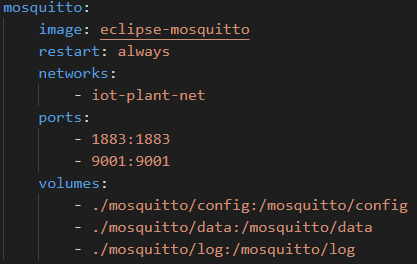

# PlantCare-IOT

PlantCare is a prototype of a smart plant irrigation system based on the Node-RED environment. The garden irrigation control is based on the weather forecast.

## System virtual devices

System contains two virtual devices:

- soil-sensor: checks the level of soil hydration and reacts to the low level case. Additionally, it has set a trigger for every morning and evening at fixed hours . Depending on the weather forecast for the day, irrigates the soil accordingly.
- sprinkler: thanks to mqtt broker, it listens for information about the need to water the soil and performs the task accordingly.

## Run application

All the components needed to run the system are stored in Docker containers. For easy running multi-container Docker applications, the **_docker-compose.yaml_** was created.

To run all necesary components:

```
docker compose up -d
```

To run Python files:

```
python sensor.py
python soil.py
python sprinkler.py
```

## Tools

### NodeRed

Default server is `http://127.0.0.1:1880/`

System layout:


### Eclipse Mosquitto

To enable communication between virtual devices, the system use Eclipse Mosquitto - an open source (EPL/EDL licensed) message broker that implements the MQTT protocol.

Functions used to manage the transmission:

- *Connect* – to establishes a connection with the broker,
- *Subscribe* – to subscribes (listens) to a given topic on the broker,
- *Publish* – to publishes (sends) information on a given topic, through a broker, to all clients subscribing to a given topic.

The system has two topics: soil-sensor and sprinkler.

### Weather

To get the information about the daily weather forecast we use the openweathermap API.

### Redis

The level of the soil hydration is stored in the Redis database. Thanks to this approach, all the virtual devices have the access to this information.

Default port: `"6379:6379"`

## Diagrams


## Docker

There are 3 images used:

- **MQTT**
  For the MQTT server we used the Eclipse Mosquitto image.
  https://hub.docker.com/_/eclipse-mosquitto

  

- **Node-RED**
  Image is built using Dockerfile. Based on nodered/node-red image.\
  https://hub.docker.com/r/nodered/node-red

  

  _package.json_ file contains all required dependencies for node-red and scripts to run it:

  

  _soil_data_9_ file stores data for charts. \
  _settings.js_ file stores settings that are loaded into the runtime as a Node.js module that exports a JavaScript object of key/value pairs. \
  _flows_cred.js_ is credentials file. It is encrypted by default to ensure its contents cannot be easily read. We provides the key for the encryption in the settings.js file. If another instance of Node-RED doesn't have the same encryption key, it won't be able to decrypt the file. \
  _flows.js_ file stores the node-red flow which is loaded and then run when application starts. \

  Dockerfile is used to build the image inside docker-compose file:

  

- **Redis**
  For the Redis we used the Redis image.
  https://hub.docker.com/_/redis

  

All 3 images are put inside one container using docker-compose which lets us set up and run all images using one docker command.
All images are connected with the same network: _iot-planet-net_.


## Scripts
